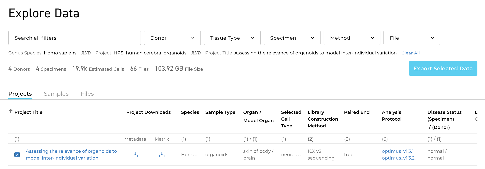
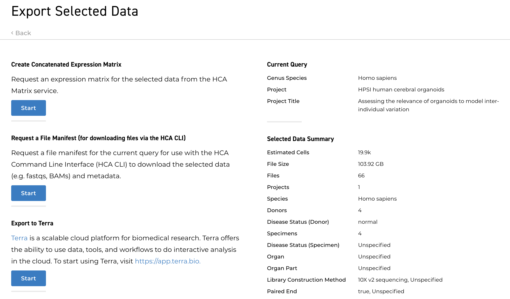

```{r, include = FALSE}
knitr::opts_chunk$set(
  collapse = TRUE,
  cache = TRUE
)
```

# Changes to the Data Coordination Platform

- [Big changes][] in availablility of services outlined here.
- Improvements include availability of controlled access data.
- We'll track these, with updates to the packages and work flows
  outlined here.

[Big changes]: https://data.humancellatlas.org/coming-soon-DCP-2-with-support-for-controlled-access-data

# AnVIL and the Terra platform

[AnVIL][] and [Terra][]

- US NHGRI (Google) cloud-based computation and data access environment.
- Fast access to large public and protected consortium-scale data.
- Highly scalable computational workflows.
- RStudio and Jupyter notebook environments

HCA on Terra

```{r, echo = FALSE}


```

- Easily 'export' experiments to terra, including large files.
- Files are exported as links.
- Data does not leave the cloud.
- Fast movement from storage to compute nodes.
- Workflows available within AnVIL, e.g., the [HCA Optimus Pipeline][].
- No 'egress' charges.

[HCA Optimus Pipeline]: https://anvil.terra.bio/#workspaces/featured-workspaces-hca/HCA_Optimus_Pipeline


Bioconductor on Terra

- Growing suite of workspaces highlighting Bioconductor packages,
  workflows, and tutorials.
- HCA examples available.
- Early access? Contact [me][] with your Terra login email and ask to
  be added to the Bioconductor\_User group.

[AnVIL]: https://anvilproject.org
[Terra]: https://app.terra.bio
[me]: mailto:mtmorgan.bioc@gmail.com

# Acknowledgments

A portion of this work is supported by the Chan Zuckerberg Initiative
DAF, an advised fund of Silicon Valley Community Foundation.

Research reported in this presentation was supported by the NHGRI and
NCI of the National Institutes of Health under award numbers
U41HG004059, U24CA180996, and U24CA232979. The content is solely the
responsibility of the authors and does not necessarily represent the
official views of the National Institutes of Health.

## Special thanks

- Daniel van Twisk (LoomExperiment, HCAExplorer)
- Marcel Ramos (HCAMatrixBrowser)

## Bioconductor Seed Network PIs

- Aedin Culhane (Dana-Farber)
- Davide Risso (U Padova)
- Greg Finak (Fred Hutch)
- Kasper D Hansen (JHU)
- Martin Morgan (Roswell)
- Matt Ritchie (WEHI)
- Stephanie Hicks (JHU)
- Wolfgang Huber (EMBL)
